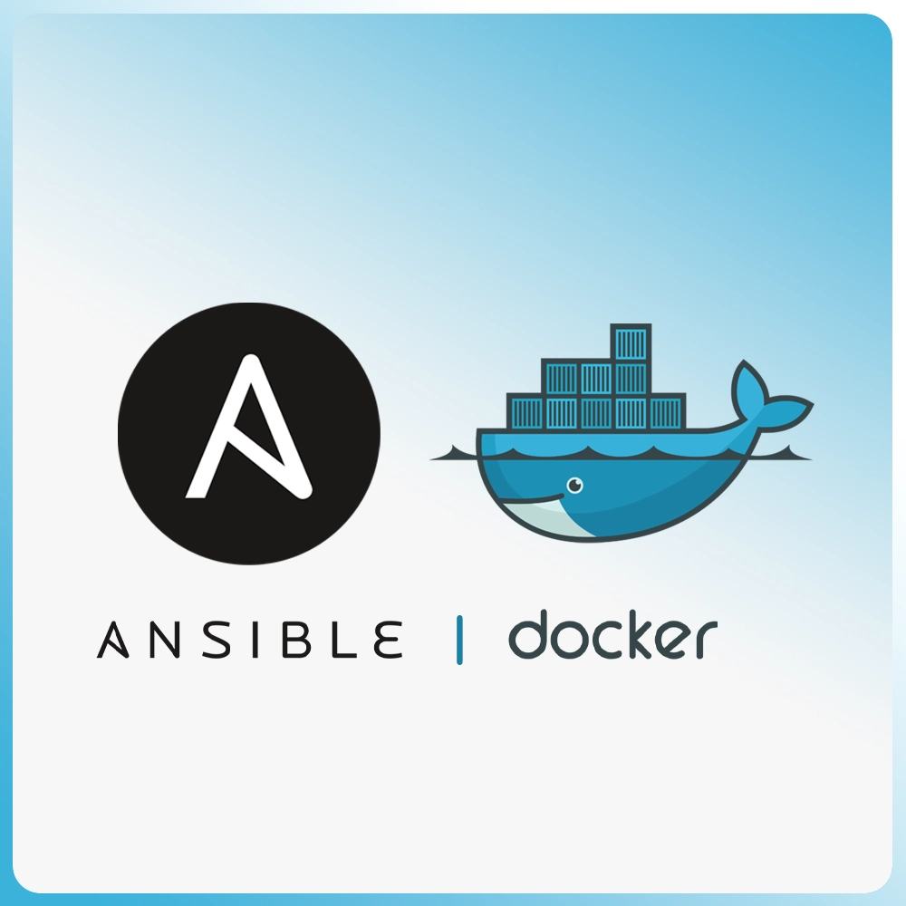

# Ansible Role: Advanced Docker Engine Installation and Configuration

[](https://galaxy.ansible.com/devops_store/docker_engine)
[](https://devops.store)

> **💡 Vous utilisez ce rôle en production ?**
> Ce projet est maintenu gratuitement par **DevOps Store**.
> Soutenez notre travail (et gagnez du temps) en découvrant nos modules Premium certifiés :
> 👉 **[Voir nos modules Haute Disponibilité (Keycloak, Postgres...)](https://devops.store)**

<p align="center">
  
</p>

## 1. Summary

The `docker_engine` Ansible role is a **production-ready** solution that installs and configures the Docker engine by integrating all best practices, specific network configurations, and necessary patches to ensure stability in virtualization and CI/CD environments.

## 2. Key Features

This role provides the following features:

* **CI/CD Compliance (Molecule)**: Role tested and stable on Debian 12/13 and Ubuntu 22.04/24.04. Includes critical patches to ensure idempotence in **Docker-in-Docker (DinD)** environments.
* **Multi-OS Compatibility**: Dynamic support for **Debian 12 (Bookworm)**, **Debian 13 (Trixie)**, **Ubuntu 22.04 LTS (Jammy)** and **Ubuntu 24.04 LTS (Noble)**.
* **Non-Destructive Configuration**: Uses JSON merging to update **/etc/docker/daemon.json** without overwriting existing settings.
* **Storage Management (Data-Root)**: Allows moving Docker's main storage directory to a dedicated data disk.
* **User Management**: Add specific users to the `docker` group to allow running commands without `sudo`.
* **Orchestration Preparation**: Installs **Python SDK (`python3-docker`)** required for using Ansible `community.docker.*` modules.
* **Proxy Configuration**: Manages `HTTP_PROXY`, `HTTPS_PROXY` variables via **systemd drop-in** files.
* **Integrated Best Practices**: Log rotation, Live Restore, Prometheus metrics (optional).
* **Automatic Maintenance**: Daily **Cron job** (`docker system prune -a --force --filter 'until=24h'`) for resource cleanup.

## 3. Prerequisites

* **Operating System**: Debian 12/13 or Ubuntu 22.04/24.04.
* **Ansible**: Installed and configured on the control machine.
* **Privileges**: The playbook must be executed with a user having `sudo` privileges (`become: true`).

## 4. Configuration Variables (Playbook Example)

This role uses the fully qualified collection name (FQCN) `devops_store.docker_engine` defined in metadata for Galaxy/CI compliance.

### `your_playbook.yml` Example

```yaml
---
- hosts: all
  become: true
  
  vars:      
    # --- 1. DAEMON & USERS CONFIGURATION ---
    docker_users:
      - "dev_user"
      - "ci_service"
    docker_data_root: "/mnt/data/docker-storage" # Main storage path
    docker_dns_servers:
      - "10.1.1.1" # Primary internal DNS
      - "1.1.1.1" 
    docker_insecure_registries:
      - "registry.internal.lan:5000"
      
    # Enable Prometheus metrics
    docker_enable_metrics: true
    
    # --- 2. PROXY CONFIGURATION (via Systemd) ---
    # Uncomment if needed
    # docker_http_proxy: "http://proxy.mycompany.com:8080"
    # docker_https_proxy: "http://proxy.mycompany.com:8080"
    # docker_no_proxy: "localhost,127.0.0.1,.lan"

  roles:
    - role: devops_store.docker_engine
```

### `your_inventory` Example

```ini
[debian_servers]
debian-trixie-01 ansible_host=192.168.1.10
debian-bookworm-02 ansible_host=192.168.1.11

[ubuntu_servers]
ubuntu-noble-01 ansible_host=192.168.1.20
ubuntu-jammy-02 ansible_host=192.168.1.21

[all:vars]
# General configuration applied to all servers
docker_dns_servers=["1.1.1.1", "9.9.9.9"]
docker_enable_metrics=True
docker_prune_enabled=True

[behind_proxy]
# Machines requiring a proxy to access external resources
debian-trixie-01
ubuntu-jammy-02

[behind_proxy:vars]
docker_http_proxy="http://proxy.mycompany.com:8080"
docker_https_proxy="http://proxy.mycompany.com:8080"
docker_no_proxy="localhost,127.0.0.1,.lan,.local"
```

## 5. Running the Playbook

```bash
ansible-playbook -i your_inventory your_playbook.yml
```

## 6. Important Notes

* **Test Files**: The complete test configuration is available in the `molecule/default/` folder (including `Dockerfile.j2` and `verify.yml`).
* **Variable Priority**: Configuration is done using variables defined in your playbook or inventory. They override default values defined in `defaults/main.yml`.
* **Idempotence**: The role is fully idempotent. It can be run multiple times without risk of altering an already configured system.
* **Dependencies**: The role manages the installation of necessary tools (`curl`, `gnupg`, `ca-certificates`).
* **Maintenance**: The cleanup Cron job is configured to run at 3:00 AM. You can modify this time via the `docker_prune_hour` and `docker_prune_minute` variables.

## 7. Operational Documentation

Detailed documentation is available in the `docs/` folder:

| Document | Description |
|----------|-------------|
| [`docs/day1-guide.md`](docs/day1-guide.md) | **Day 1 Guide**: Post-deployment checks, basic commands, health checklist |
| [`docs/day2-runbook.md`](docs/day2-runbook.md) | **Day 2+ Runbook**: Troubleshooting, disk management, networks, updates, recovery scenarios |
